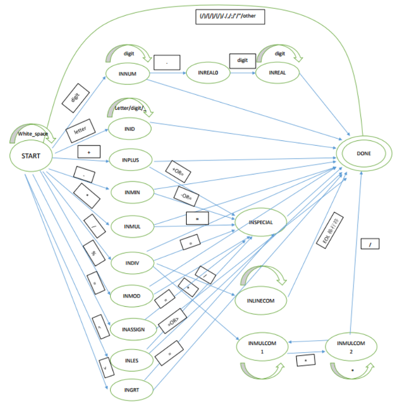
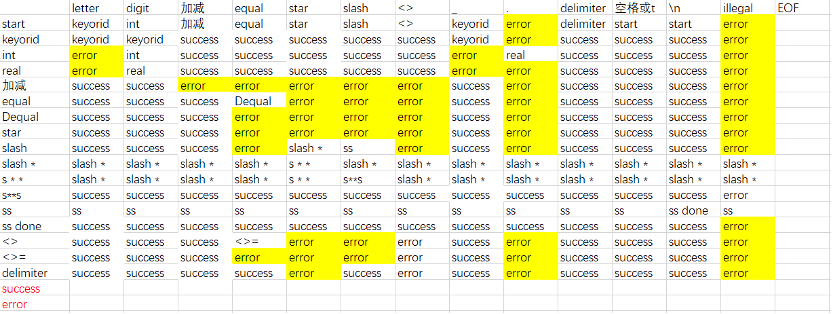
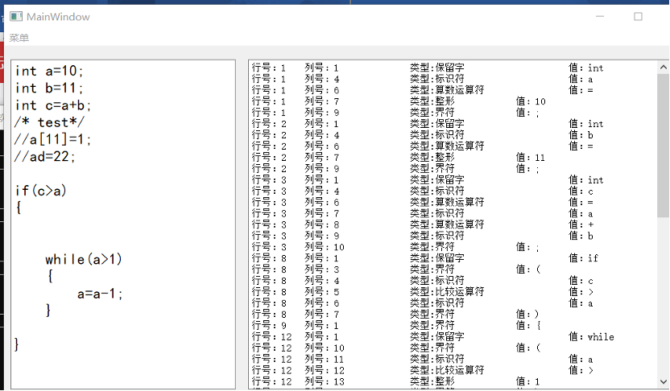
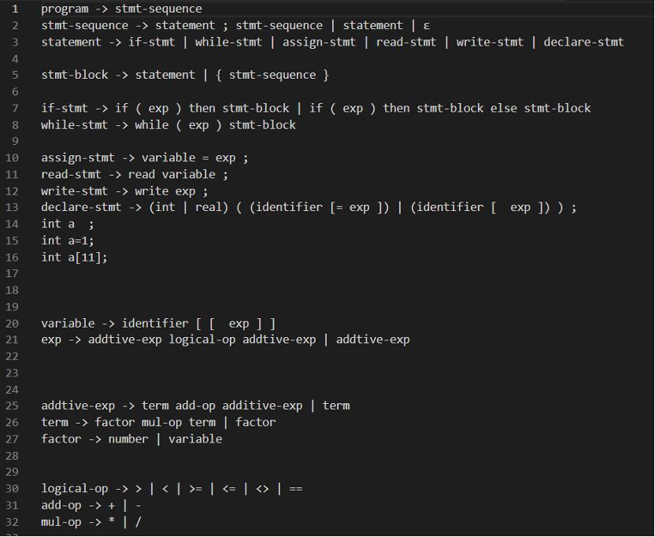
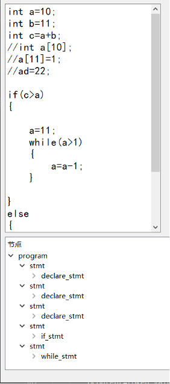
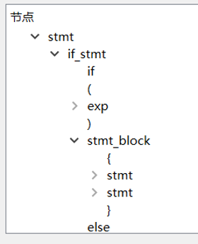
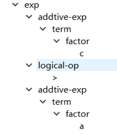
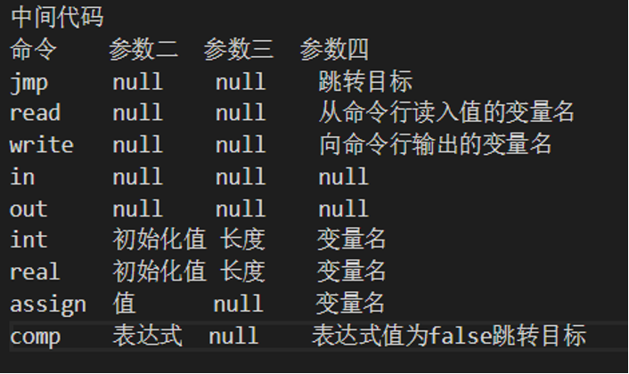
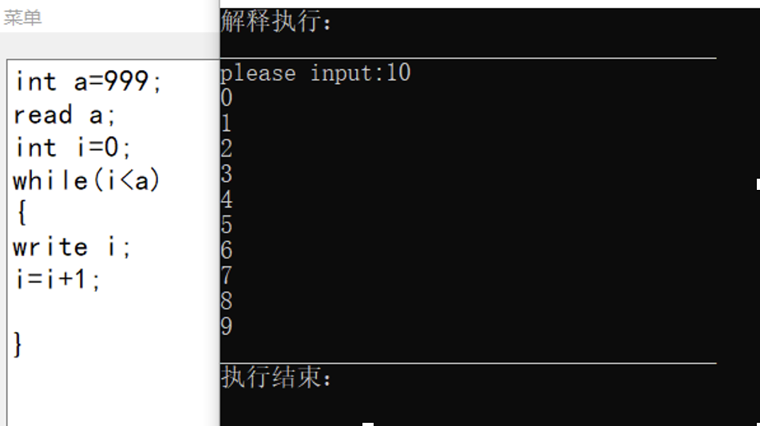

#WHU 2019 Spring intro to compiler 2019.6
  compiler for C-- programming language ( a subset of C programming language)
 components:
 lexer: The Lexer module is the lexical analysis module, which reads CMM source code and generates a sequence of tokens representing meaningful words such as keywords and identifiers. If there are any errors, it records the type of error that occurred and its location.
 
 
 
 
 
 parser： The Parser module is the syntax analysis module, which reads the token sequence generated by lexical analysis and produces the syntax tree of the source code. If there are any errors, it records the error type and the position in the syntax tree.
 
 
 
 
 
 
 semantic：The Semantic module is the semantic analysis module, which performs semantic analysis while generating intermediate code.
 
 
 
 
 executer: The Exer module is the interpretation execution module, which reads the intermediate code generated by the semantic module and interprets it.
 
 
 
 UI: developed by QT